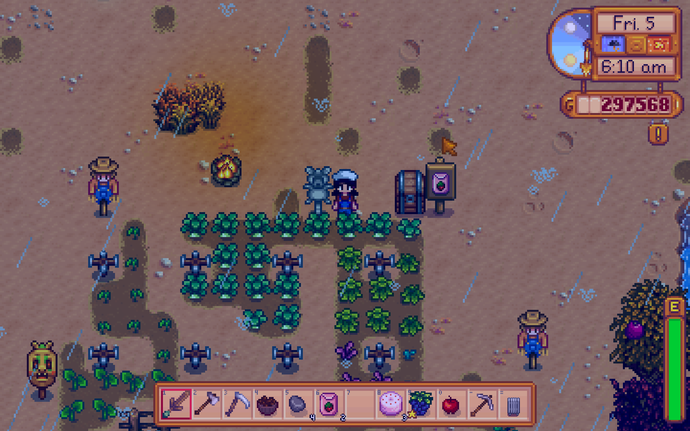

# IGME-235

 # Story
 Have you ever wanted to feed a cow? Of course you have. But here's the problem: the cow is hungry. And you've dropped the food. Collect the food you dropped and drop it in the cow's bowl before time runs out! 
# Mechanics
## Moving Cow
The cow will act as a barrier to avoid. If the farmer hits the cow, his health will go down according to the cow's stats.
## Collect Food
The food will be hidden throughout the farm area. The farmer will have to pick it up and avoid the cow before returning it to the cow's feeding troff.The more the cow can eat, the fatter he gets and the slower he gets. The slower he gets, the less likely he is to reach the farmer. Different food has different potencies. They will affect the cow differently.
## Starting Off
Players will be thrown into the games with no instructions other than "MOOOOVE OVER FOR THE COW!" Yes, this is confusing, but what about this isn't confusing? I too am confused! 
## Controls
WASD to move, click to get and place food
## Aesthetics
2d pixel game much like Stardew Valley

## Platform
A web based game
## About the developer
My name is Kimmy. I am a Kimmy. I like Stardew Valley and Untitled Goose :D.  I do a lot of things and I really, really love Squishmallows. I am a Gamification Programmer for a startup out of LA. I also do a lot of work for Unity Technologies including stuff for Learn Tutorials and being a Unity Student Ambassador. I also do a lot of hackathons. My favorite hackathon project has either been a pancake robot that prints pancakes based on an image or Project Focus which uses machine learning to do some fun things. Come see me during my labbie hours in the big IGM lab! 
            